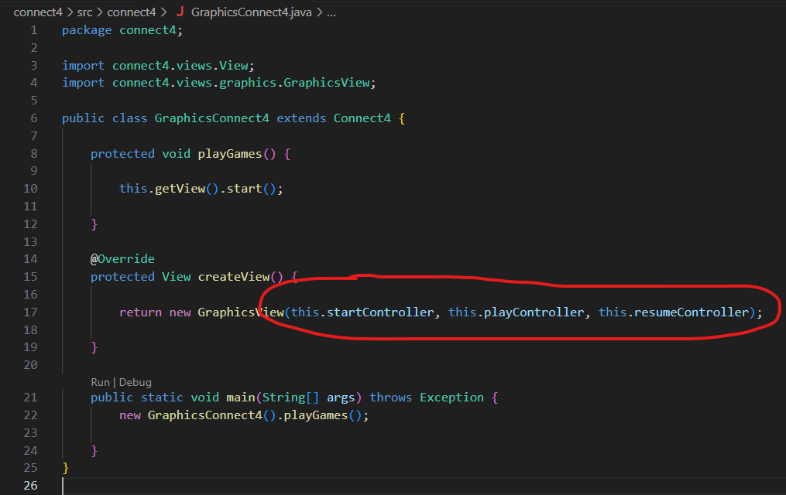

## Diferentes versiones del juego Connect 4

| Requistios  | Versión |
|:------------- |:-------------|
| basic  | domainModel - basic|
| machine | domainModel - machine |
| basic | documentView - basic |
| machine | [v.1.0 documentView - machine - doubleDispatching](https://github.com/js-rom/connect4/tree/v.1.0) |
| machine | [v.1.1 documentView - machine - Menu](https://github.com/js-rom/connect4/tree/v.1.1) |
| machine | [v.1.2 documentView - machine - IA Player Open Close](https://github.com/js-rom/connect4/tree/v.1.2) |
| machine | [v.1.3 documentView - machine - prototype](https://github.com/js-rom/connect4/tree/v.1.3) |
| graphics | [v.1.4 documentView - withoutFactoryMethod](https://github.com/js-rom/connect4/tree/v.1.4) |
| graphics | [v.1.5 documentView - withFactoryMethod](https://github.com/js-rom/connect4/tree/v.1.5) |
| graphics | [v.1.6 modelViewPresenter - presentationModel - basic](https://github.com/js-rom/connect4/tree/v.1.6) |
| graphics | modelViewPresenter - presentationModel - withFacade |
| graphics | modelViewPresenter - presentationModel - withoutDoubleDispatching |
| graphics | modelViewPresenter - presentationModel - withDoubleDispatching |
| undoRedo | modelViewPresenter - presentationModel - withComposite |
| distributed | modelViewPresenter - presentationModel - withoutProxy |
| distributed | modelViewPresenter - presentationModel - withProxy |
| files | modelViewPresenter - presentationModel - withoutDAO |
| files | modelViewPresenter - presentationModel - withDAO |
| bbdd | modelViewPresenter - presentationModel - withoutPrototype |
| bbdd | modelViewPresenter - presentationModel - withPrototype |
| basic | modelViewPresenter - passiveView |
| basic | modelViewPresenter - supervisorController |
| basic | modelViewController |

# Versión v.1.6

## Problemas de diseño de la versión v.1.6

El problema que tenemos en esta version 1.6 radica en cómo estamos asociando GraphicsView o ConsoleView con
los controladores. Se lo estamos pasando como argumentos en el constructor. Si pretendemos que esta proyecto 
siga creciendo e imaginemos que tenemos 240 controladores, obviamente es inviable pasar 240 parámetros.

## Soluciones de diseño a la versión v.1.5

Cramos nueva capa de controladores que separa a las vistas de la complejidad de los modelos.
Hasta ahora creábamos las vistas y a estas les asociábamos el modelo. 
Ahora creamos las vistas asociandolas a un controlador, el cual ya está asociado a un modelo.

De esta forma el proyecto puede seguir creciendo pues la capa controladora resuelve las tres situaciones comentadas anteriormente:
 - Reutilización de código por varias vistas diferentes (web, desktop, movil...)
 - Triturar una interfaz demasiado grande.
 - Crear módulo cohesivo que agrupe operaciones sobre entideades diferentes.

## Problemas de diseño de la versión v.1.5

### Ausencia de controladores.

#### ¿Por qué necesitamos controladores? Justificación:
   
vamos a analizar el problema en tres dimensiones diferentes:
 - Reutilización de código por varias vistas diferentes (web, desktop, movil...)
 - Triturar una interfaz demasiado grande.
 - Crear módulo cohesivo que agrupe operaciones sobre entideades diferentes.

    ##### Reutilización de código por varias vistas diferentes (web, desktop, movil...):
    imaginamos que tenemos 7 vistas diferentes y cada una de ellas se comunican con el Game. Ahora maginemos que lo que cada una de las vistas le dice al modelo se compone de unas 3 o 4 lineas. La naturaleza de estas lineas normalmente es para hacer altas, bajas, modificaciones y consultas. Estas operaciones se repetiran en todas las vistas: en la vista web, movil, consola... ya que si separamos vistas de modelos lo que la vista le dice al modelo serepiterá en cada una de las vistas.

     Lo que se propone es reunir estas 3 o 4 lineas en un objeto controlador para así poder reutilizarlo, así las vistas ya no repiten código, solo necesitan una línea para llamar al  controlador de alta, contntrolador de baja, de modificacion, de consulta...
    
    ##### Triturar una interfaz demasiado grande:
    El problema ahora es de una naturaleza diferente. Ya no lo hacemos por reutilizar el código que relaciona a una vista con la operacion a realizar en una entidad del modelo. Sino que, el modelo a pasar a la vista tiene una interfaz demasiado grande.

    Imaginemos que estamos en un proyecto grande como por ejemplo la gestión de una universidad. Ahora resulta que tenemos un gran numero de entidades, por ejemplo 60. Cada una de estas entidades tendrá de media unos 4 operaciones a realizar sobre ellas, varias modificaciones o sonsultas, etc... lo que dan un total de 240 operaciones --demasiadas según métricas de calidad-- sobre la clase Universidad--interfaz del paquete models.

    y, ¿qué hacemos con las clases inmensamente gordas?: las trituramos con el patrón Visitor. Cada uno de los 240 métodos los convertimos a una clase controlador. Pero en este caso no exisitirá métodos accept() y visit() por que aquí no se comparte ninguna estructura de datos que reccorrer. Entonces no es el patrón visitor... ya... pero, podemos decir que está muy cerca y que comparte parte del objetivo del visitor que es triturar una clase gorda en una clase por cada una de sus métodos.

    Es decir, los controladores son la cosificación de los métodos de una supuesta clase gordísima que no nos interesa hacer y los atributos de estas clases serían los modelitos que manejan los controladores (clases del paquete models), como un array de alumnos, profesores, etc...

    ##### Crear módulo cohesivo que agrupe operaciones sobre entideades diferentes:
    La tercera justificación consiste en modularizar procesos que tratan con varias entidades, por lo que no está claro en que modelo concreto debería de ir este código, por lo que finalmente lo mejor es situarlo en un controlador.

    imaginemos que sobre el juego del Conecta 4 empiezan a pedirnos nuevos procesos que implican a varios modelos, por ejemplo incluir estadisticas de partidas y de campeonatos y que nos solicitan un informe para recuperar las peores partidas de los mejores campeonatos... ¿En qué modelo pondríamos este código? la responsabilidad de este proceso no está nada clara por lo que la mejor opcion es crear un módulo cohesivo que agrupe a este proceso, es decri un controlador.