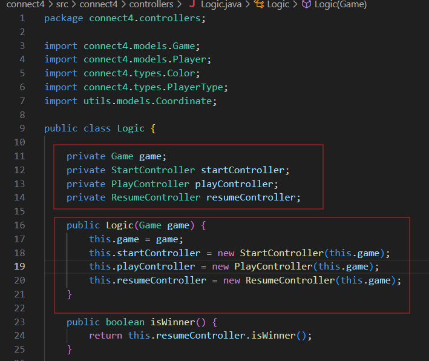

## Diferentes versiones del juego Connect 4

| Requistios  | Versión |
|:------------- |:-------------|
| basic  | domainModel - basic|
| machine | domainModel - machine |
| basic | documentView - basic |
| machine | [v.1.0 documentView - machine - doubleDispatching](https://github.com/js-rom/connect4/tree/v.1.0) |
| machine | [v.1.1 documentView - machine - Menu](https://github.com/js-rom/connect4/tree/v.1.1) |
| machine | [v.1.2 documentView - machine - IA Player Open Close](https://github.com/js-rom/connect4/tree/v.1.2) |
| machine | [v.1.3 documentView - machine - prototype](https://github.com/js-rom/connect4/tree/v.1.3) |
| graphics | [v.1.4 documentView - withoutFactoryMethod](https://github.com/js-rom/connect4/tree/v.1.4) |
| graphics | [v.1.5 documentView - withFactoryMethod](https://github.com/js-rom/connect4/tree/v.1.5) |
| graphics | [v.1.6 modelViewPresenter - presentationModel - basic](https://github.com/js-rom/connect4/tree/v.1.6) |
| graphics | [v.1.7 modelViewPresenter - presentationModel - withFacade](https://github.com/js-rom/connect4/tree/v1.7.0-Release) |
| graphics | modelViewPresenter - presentationModel - withoutDoubleDispatching |
| graphics | modelViewPresenter - presentationModel - withDoubleDispatching |
| undoRedo | modelViewPresenter - presentationModel - withComposite |
| distributed | modelViewPresenter - presentationModel - withoutProxy |
| distributed | modelViewPresenter - presentationModel - withProxy |
| files | modelViewPresenter - presentationModel - withoutDAO |
| files | modelViewPresenter - presentationModel - withDAO |
| bbdd | modelViewPresenter - presentationModel - withoutPrototype |
| bbdd | modelViewPresenter - presentationModel - withPrototype |
| basic | modelViewPresenter - passiveView |
| basic | modelViewPresenter - supervisorController |
| basic | modelViewController |

# Versión v.1.7

## Problemas de diseño de la versión v.1.7

- Vistas con DRY en la lógica de control.
- Clase Logic no adecuada por número de parámetros y creación de controladores.

## Soluciones de diseño a la versión v.1.6

Clase lógica "Logic" que encapsula a controladores y modelos. Ahora soolo tenemos que acsociar 
GraphicsView o ConsoleView con una clase Logic. Aunque el problema no ha desaparecido solo lo hemos movido de lugar, tenemos 
una clase Logic--imaginemos que-- con potencialmente 240 atributos y 240 creaciones de controladores. Esto tampoco es mantenible.

## Problemas de diseño de la versión v.1.6

El problema que tenemos en esta version 1.6 radica en cómo estamos asociando GraphicsView o ConsoleView con
los controladores. Se lo estamos pasando como argumentos en el constructor. Si pretendemos que esta proyecto 
siga creciendo e imaginemos que tenemos 240 controladores, obviamente es inviable pasar 240 parámetros.

