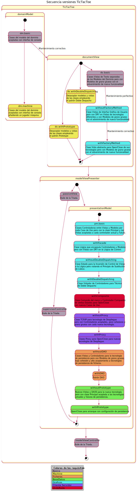

## Diferentes versiones del juego Connect 4

| Requistios  | Versión |
|:------------- |:-------------|
| basic  | domainModel - basic|
| machine | domainModel - machine |
| basic | documentView - basic |
| machine | [v.1.0 documentView - machine - doubleDispatching](https://github.com/js-rom/connect4/tree/v.1.0) |
| machine | [v.1.1 documentView - machine - Menu](https://github.com/js-rom/connect4/tree/v.1.1) |
| machine | [v.1.2 documentView - machine - IA Player Open Close](https://github.com/js-rom/connect4/tree/v.1.2) |
| machine | [v.1.3 documentView - machine - prototype](https://github.com/js-rom/connect4/tree/v.1.3) |
| graphics | [v.1.4 documentView - withoutFactoryMethod](https://github.com/js-rom/connect4/tree/v.1.4) |
| graphics | [v.1.5 documentView - withFactoryMethod](https://github.com/js-rom/connect4/tree/v.1.5) |
| graphics | [v.1.6 modelViewPresenter - presentationModel - basic](https://github.com/js-rom/connect4/tree/v.1.6) |
| graphics | [v.1.7 modelViewPresenter - presentationModel - withFacade](https://github.com/js-rom/connect4/tree/v1.7.0-Release) |
| graphics | [v.1.8 modelViewPresenter - presentationModel - withoutDoubleDispatching](https://github.com/js-rom/connect4/tree/v1.8.0-Release) |
| graphics | [v.1.9 modelViewPresenter - presentationModel - withDoubleDispatching](https://github.com/js-rom/connect4/tree/v1.9.0-Release)  |
| undoRedo | modelViewPresenter - presentationModel - withComposite |
| distributed | modelViewPresenter - presentationModel - withoutProxy |
| distributed | modelViewPresenter - presentationModel - withProxy |
| files | modelViewPresenter - presentationModel - withoutDAO |
| files | modelViewPresenter - presentationModel - withDAO |
| bbdd | modelViewPresenter - presentationModel - withoutPrototype |
| bbdd | modelViewPresenter - presentationModel - withPrototype |
| basic | modelViewPresenter - passiveView |
| basic | modelViewPresenter - supervisorController |
| basic | modelViewController |



# Versión v.1.9

## Soluciones de diseño a la versión v.1.8

- ~~Violación del Principio de Sustitución de Barbara Liskov.~~

Esta versión evita preguntar por el tipo para abrir distintas ramas de sentencias alternativas para tratar cada tipo de clase derivada.

Solución aplicando la técnica del doble despacho:
- La jerarquía de clases no conoce directamente a los clientes sino que conoce únicamente a una interfaz que cumple todo cliente que visita la jerarquía, visitador genérico (controllers.ControllerVisitor).
``` java

public interface ControllerVisitor {
    
    void visit(StartController startController);

    void visit(PlayController playController);

    boolean visit(ResumeController resumeController);
}

```
    - La nueva clase derivada debe redefinir el método aceptar para no ser abstracta enviando un mensaje visitar auto-pasandose por parámetro

``` java
public class StartController extends Controller {

    //...

    @Override
    public void accept(ControllerVisitor controllerVisitor) {
        controllerVisitor.visit(this);
    }

}

```
    - Los cambios están guiados por el compilador porque cada clase cliente debe definir un nuevo método visitar para la nueva clase derivada

```java

public class ConsoleView implements View, ControllerVisitor {

    // ...

    @Override
    public void visit(StartController startController) {
        this.start(startController);
    }

    @Override
    public void visit(PlayController playController) {
        this.play(playController);
    }

    @Override
    public boolean visit(ResumeController resumeController) {
        return this.resume(resumeController);
    }

}

```

Consecuencias:

- No viola el Principio de Sustitución de Liskov preguntando por el tipo de objeto polimórfico
```java

public class ConsoleConnect4 extends Connect4 {

    protected void playGames() {
        do {
            if (logic.getController() != null) {
                logic.getController().accept((ConsoleView)this.getView());
            }
        } while (logic.getController() != null);
    }

    // ...
}    
```
- No incurre en cambios divergentes para atender con una nueva rama en cada clase cliente
- No rompe el principio Open/Close con cambios en el interior de los métodos del cliente
- Con "leve" intimidad inapropiada con ciclos dentro del mismo paquete entre todas las clases de la jerarquía con la interfaz de los clientes, que no requiere pruebas ni comprensión porque no aporta código de implementación
- Bajo acoplamiento según tienden a crecer los clientes porque no todas las clases de la jerarquía conocen a todas las clases de clientes, solo conocen a la interfaz de todos los clientes


## Problemas de diseño de la versión v.1.8

- Violación del Principio de Sustitución de Barbara Liskov.
En connect4.ConsoleConnect4 y connect4.GraphicsConnect4 estamos preguntado por el tipo de un objeto polimórfico en una **estructura de control de flujo de ejecución** para en función del tipo hacer una cosa u otra.

```java

if (logic.getController() instanceof StartController) {
    graphicsView.start((StartController) logic.getController());
} else {
    if (logic.getController() instanceof PlayController) {
        graphicsView.play((PlayController) logic.getController());
    } else {
        graphicsView.resume((ResumeController) logic.getController());
    }
}

```

>Lo que se quiere aquí es algo como la siguiente propiedad de sustitución: si para cada objeto oT de un tipo T, hay un objeto oS de tipo S tal que para todo progama P definido en términos de T, el comportamiento de P no cambia cuando oT es sustituido por oS, entonces S es un subtipo de T
— Barbara Liskov
A behavioral notion of subtyping. ACM Transactions on Programming Languages and Systems (TOPLAS). Volume 16. Issue 6 (November 1994). pp. 1811. 1841

- incurre en cambios divergentes para atender con una nueva rama en cada clase cliente que hay que localizar por toda la aplicación

- rompe el principio Open/Close con cambios en el interior de los métodos del cliente
