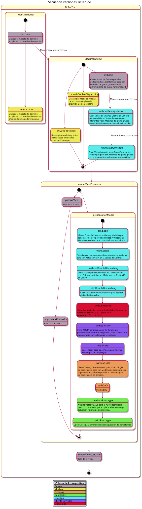

## Diferentes versiones del juego Connect 4

| Requistios  | Versión |
|:------------- |:-------------|
| basic  | domainModel - basic|
| machine | domainModel - machine |
| basic | documentView - basic |
| machine | [v.1.0 documentView - machine - doubleDispatching](https://github.com/js-rom/connect4/tree/v.1.0) |
| machine | [v.1.1 documentView - machine - Menu](https://github.com/js-rom/connect4/tree/v.1.1) |
| machine | [v.1.2 documentView - machine - IA Player Open Close](https://github.com/js-rom/connect4/tree/v.1.2) |
| machine | [v.1.3 documentView - machine - prototype](https://github.com/js-rom/connect4/tree/v.1.3) |
| graphics | [v.1.4 documentView - withoutFactoryMethod](https://github.com/js-rom/connect4/tree/v.1.4) |
| graphics | [v.1.5 documentView - withFactoryMethod](https://github.com/js-rom/connect4/tree/v.1.5) |
| graphics | [v.1.6 modelViewPresenter - presentationModel - basic](https://github.com/js-rom/connect4/tree/v.1.6) |
| graphics | [v.1.7 modelViewPresenter - presentationModel - withFacade](https://github.com/js-rom/connect4/tree/v1.7.0-Release) |
| graphics | [v.1.8 modelViewPresenter - presentationModel - withoutDoubleDispatching](https://github.com/js-rom/connect4/tree/v1.8.0-Release) |
| graphics | [v.1.9 modelViewPresenter - presentationModel - withDoubleDispatching](https://github.com/js-rom/connect4/tree/v1.9.0-Release)  |
| undoRedo | [v.1.10 modelViewPresenter - presentationModel - withComposite](https://github.com/js-rom/connect4/tree/v1.10.0-Release) |
| distributed | modelViewPresenter - presentationModel - withoutProxy |
| distributed | [v.1.12 modelViewPresenter - presentationModel - withProxy](https://github.com/js-rom/connect4/tree/v1.12.0-Release) |
| files | modelViewPresenter - presentationModel - withoutDAO |
| files | [v.1.14 modelViewPresenter - presentationModel - withDAO](https://github.com/js-rom/connect4/tree/v1.14.0-Release) |
| bbdd | modelViewPresenter - presentationModel - withoutPrototype |
| bbdd | modelViewPresenter - presentationModel - withPrototype |
| basic | modelViewPresenter - passiveView |
| basic | modelViewPresenter - supervisorController |
| basic | modelViewController |

# Versión v.1.14

## enfoque

En esta versión se añaden nuevos requisitos:
- Exit Game
- Save Game
- Open game

## Diseño

Se hace uso del patrón DAO pora evitar el acoplamiento de los modelos a la tacnología de persistencia. De esta forma mantenemos la cohesión de los modelos al centrarse unicamente en las reglas de negocio, evitamos que crezca el tamaño de los modelos manteniendo (no empeorando) su comprensibilidad y garantizamos un enfoque open/close ya que nuevas tecnologías de persistencia no provocarán modificaciones en los modelos.

