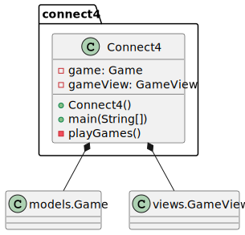
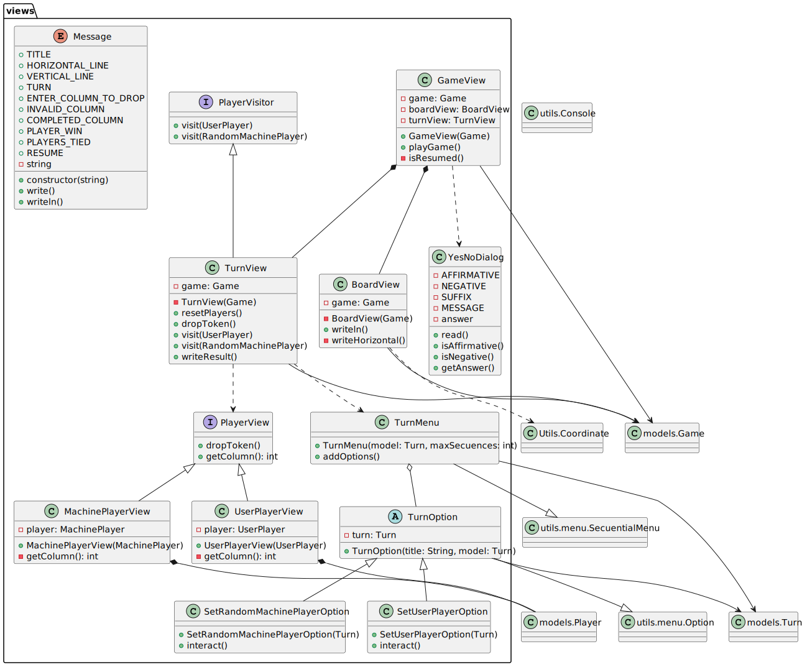
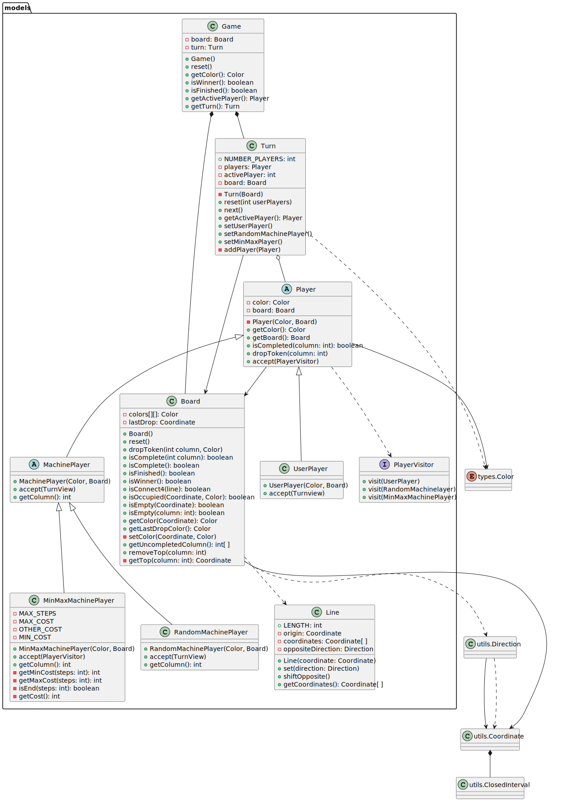
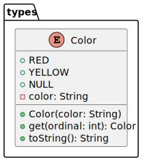
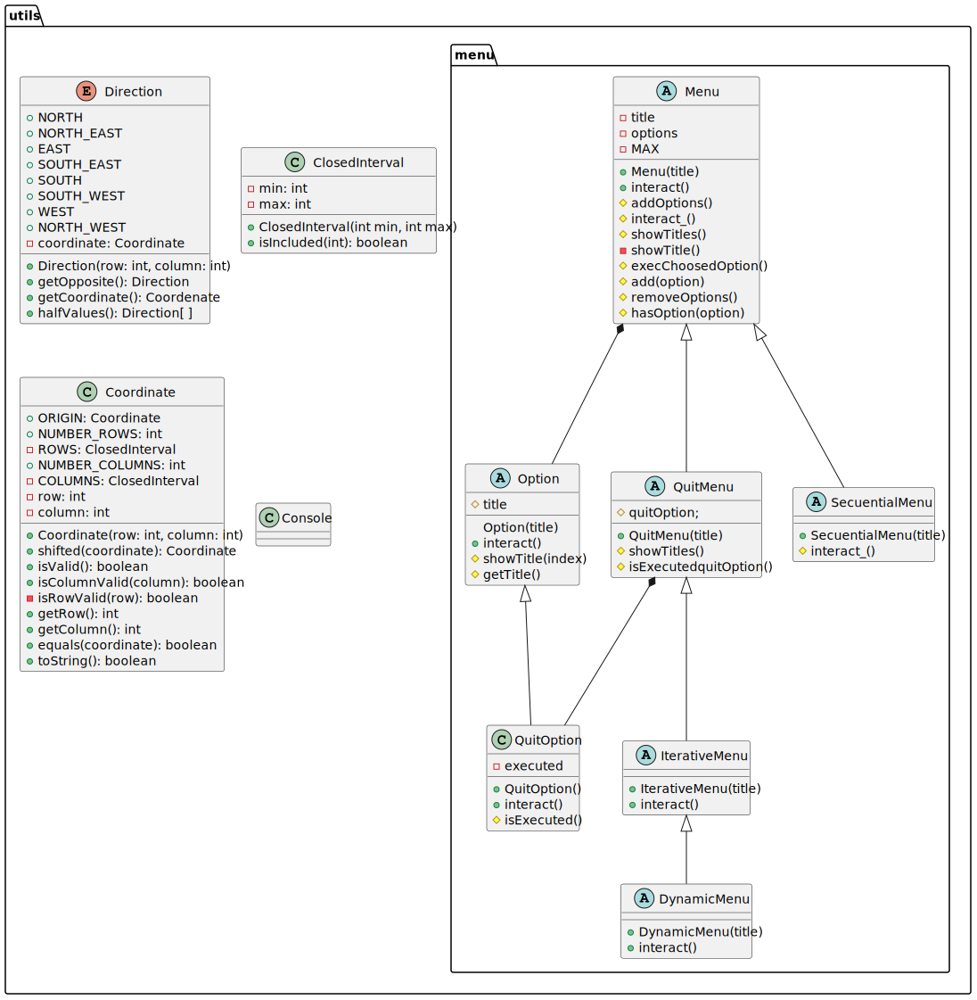

# Connect 4. Solution v.1.1 documentView - machine - Menu

# Requisitos 1. *Machine*

* Funcionalidad: **Básica**
* Interfaz: **Texto**
* Distribución: **Standalone**
* Persistencia: **No**

# Vista de Lógica/Diseño

- Arquitectura Document/View mediante **Model-View Separation Principle** y **Double Dispatching Pattern**

## Arquitectura

## connect4 Package

## connect4.views Package

## connect4.models Package

## connect4.types Package

## connect4.views utils

# Vista de Desarrollo/Implementación

# Vista de Despliegue/Física

# Vista de Procesos

- No hay concurrencia
