# Connect 4. Solution v.1.16 modelViewPresenter - presentationModel - withPrototype

## Índice

1. [Requisitos](#requisitos-6-files)

2. [Vista de Casos de Uso](#vista-de-casos-de-uso)
  - [Vista de Caso de Uso Start](#vista-de-caso-de-uso-start)
  - [Vista de Caso de Uso Open](#vista-de-caso-de-uso-open)
  - [Vista de Caso de Uso Play](#vista-de-caso-de-uso-play)  
  - [Vista de Caso de Uso Undo](#vista-de-caso-de-uso-undo)  
  - [Vista de Caso de Uso Redo](#vista-de-caso-de-uso-redo)
  - [Vista de Caso de Uso Exit](#vista-de-caso-de-uso-exit)
  - [Vista de Caso de Uso Save](#vista-de-caso-de-uso-save)
  - [Vista de Caso de Uso Resume](#vista-de-caso-de-uso-resume)

3. [Vista de Lógica/Diseño](#vista-de-lógicadiseño)
  - [Arquitectura](#arquitectura)
    - [summary view](#summary-view)
    - [detailed view](#detailed-view)
  - [launchers Package](#launchers-package)
  - [connect4.controllers Package](#connect4controllers-package)
  - [connect4.views.views Package](#connect4viewsviews-package)
  - [connect4.views.console Package](#connect4viewsconsole-package)
  - [connect4.models Package](#connect4models-package)
  - [connect4.daos Package](#connect4daos-package)
  - [connect4.net Package](#connect4net-package)
  - [connect4.types Package](#connect4types-package)
  - [connect4.utils Package](#connect4utils-package)

4. [Vista de Desarrollo/Implementación](#vista-de-desarrolloimplementación)

5. [Vista de Procesos](#vista-de-procesos)

6. [Calidad del Software](#calidad-del-software)

# Requisitos 6. *Files*

* Funcionalidad: 
  * **Jugador persona, máquina aleatorio y máquina con inteligencia artificial**
  * **Undo - Redo**
  * **Salir de la partida actual**
  * **Guardar la partida**
  * **crear una partida o abrir una partida guardada**

* Interfaz: **Texto**
* Distribución: **Standalone & distributed**
* Persistencia: **Files & bbdd**

# Vista de Casos de Uso

## Diagrama de Actores y Casos de Uso

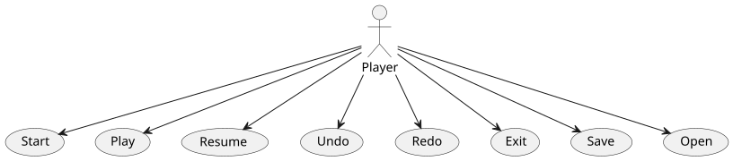

## Diagrama de Contexto

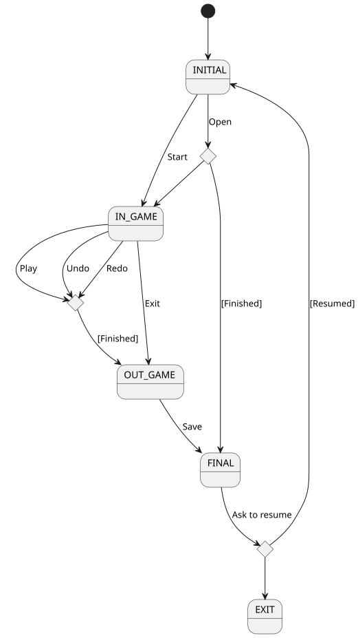

## Vista de Caso de Uso Start

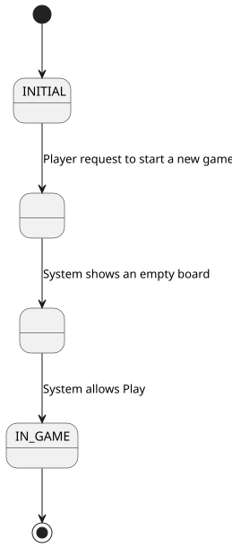

## Vista de Caso de Uso Open

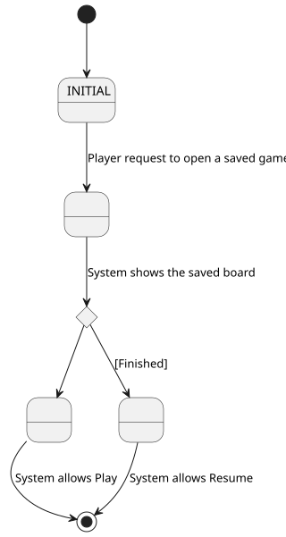

## Vista de Caso de Uso Play 

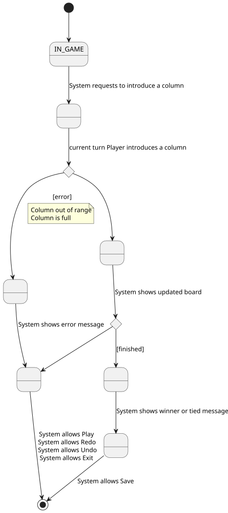

## Vista de Caso de Uso Undo 

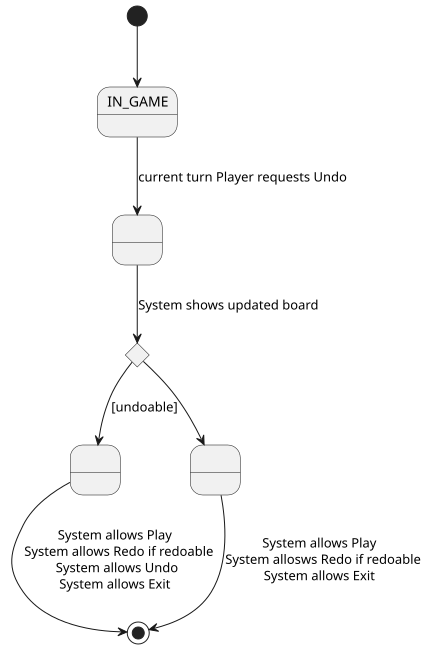

## Vista de Caso de Uso Redo  

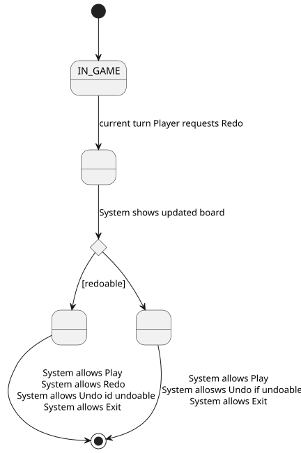

## Vista de Caso de Uso Exit

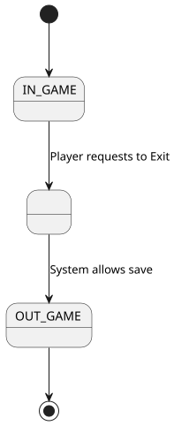

## Vista de Caso de Uso Save

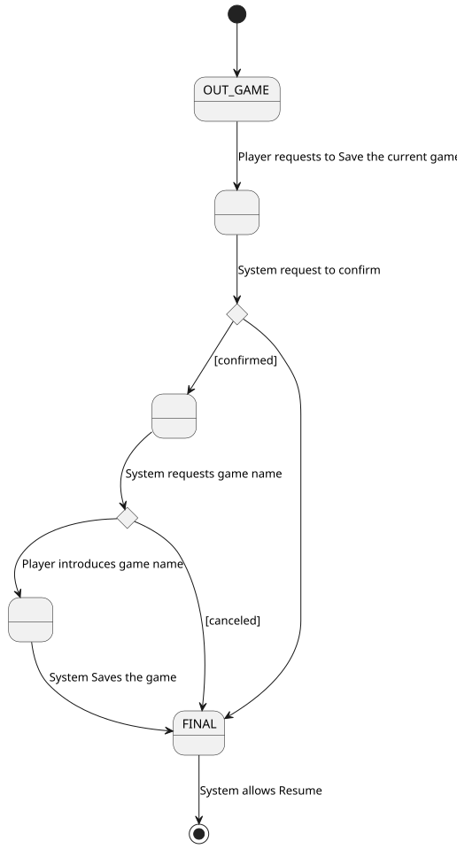

## Vista de Caso de Uso Resume 

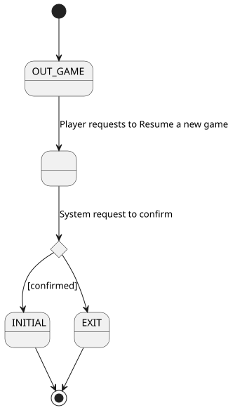

# Vista de Lógica/Diseño

- Modelo/Vista/Presentador con Presentador del Modelo con Vista Achicada
  - Patrón Command, para el menú de consola e interfaz gráfica
  - Patrón Facade, para multicontroladores y sesión
  - Patrón Memento, para la funcionalidad undo/redo
  - Patrón Factory Method para los launchers
  - Patrón Proxy para los controladores standalone & distributed
  - Patrón Prototype para los diferentes tipos de Board View según los tipos de Player
  - Técnica Doble Despacho para visitadores de vistas
  - Inversión de Control para vistas principales
  - Patrón template method para extender el comportamiento de jerarquías de herencias
  - Patrón DAO para el acceso a datos
  - Patrón repository para desacoplar la lógica de la persistencia
  - Patrón prototype y Bridse para los launchers para evitar jerarquías de herencias paralelas.

## Arquitectura

- modelViewPresenter - presentationModel
- basada en el modelo del dominio
- El conjunto de paquetes forma un Grafo Dirigído **Acíclico**

### summary view

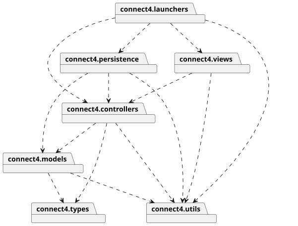

### detailed view

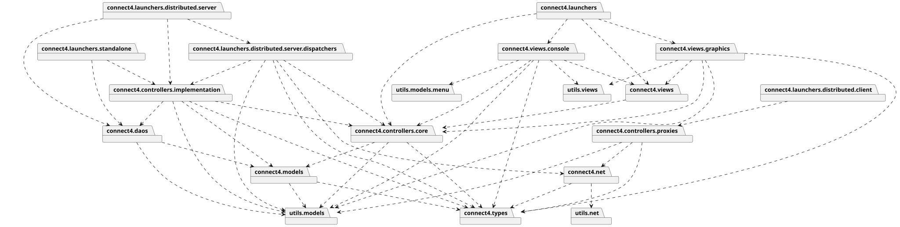

## launchers Package

## connect4.controllers Package

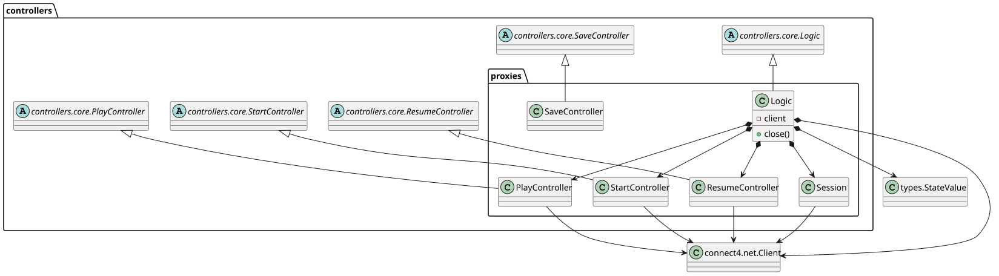

## connect4.views.views Package

## connect4.views.console Package

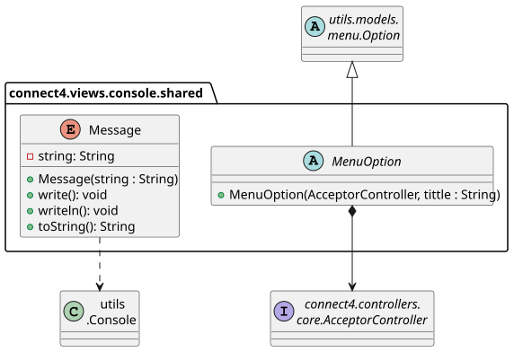

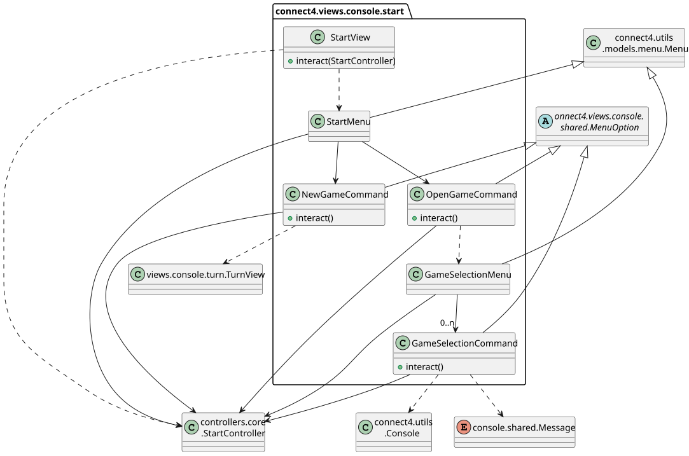

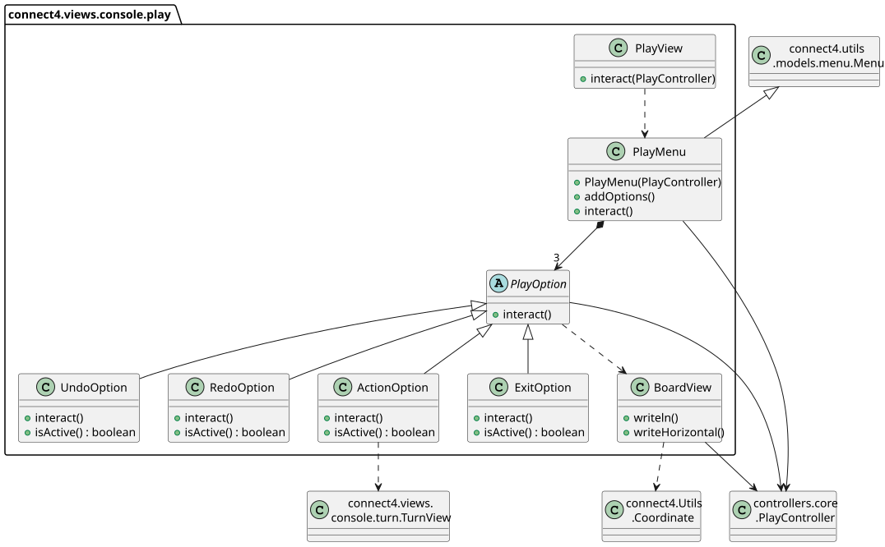

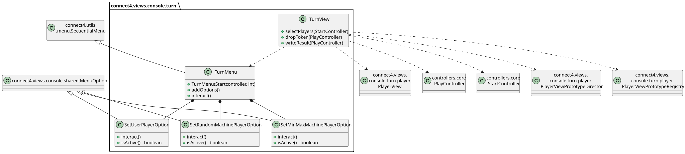

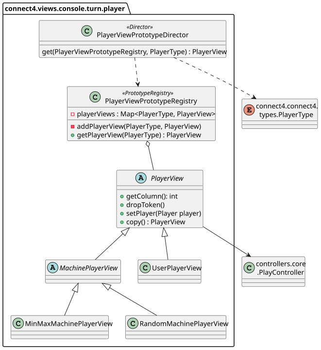

## connect4.models Package

## connect4.persistence Package

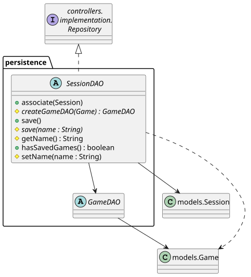

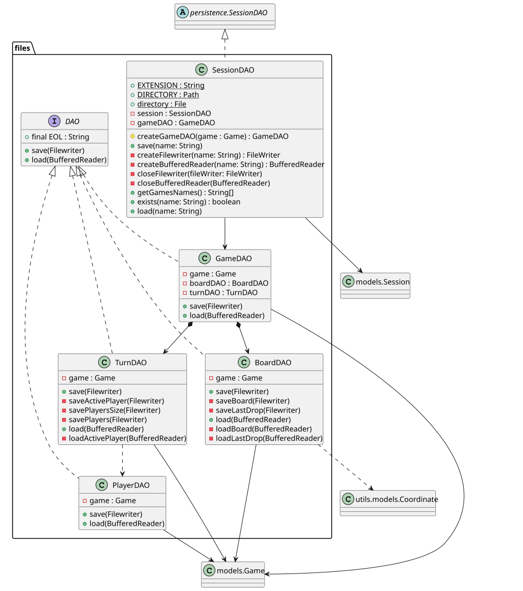

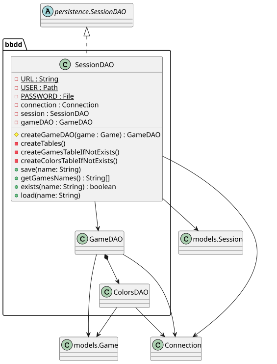

## connect4.net Package

## connect4.types Package

## connect4.utils Package

# Vista de Desarrollo/Implementación

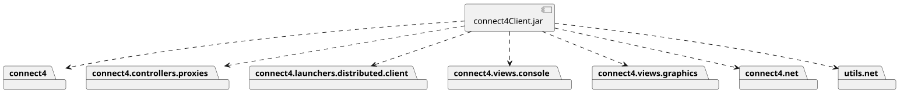

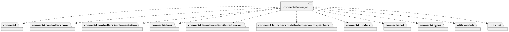

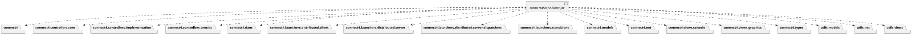

# Vista de Despliegue/Física

# Vista de Procesos

- No hay concurrencia

# Calidad del Software

