# Connect 4. Solution v.1.12 modelViewPresenter - presentationModel - withProxy

# Requisitos 5. *Distribuido*

* Funcionalidad: 
  * **Jugador persona, máquina aleatorio y máquina con inteligencia artificial**
  * **undo - redo**
* Interfaz: **Gráfica y Texto**
* Distribución: **Standalone & distributed**
* Persistencia: **No**

# Vista de Lógica/Diseño

- Modelo/Vista/Presentador con Presentador del Modelo con Vista Achicada
  - Patrón Command, para el menú de consola e interfaz gráfica
  - Patrón Facade, para multicontroladores y sesión
  - Patrón Memento, para la funcionalidad undo/redo
  - Patrón Factory Method para los launchers
  - Patrón Proxy para los controladores standalone & distributed
  - Patrón Prototype para los diferentes tipos de Board View según los tipos de Player
  - Técnica Doble Despacho para visitadores de vistas
  - Inversión de Control para vistas principales
  - Patrón template method para extender el comportamiento de jerarquías de herencias

## Arquitectura

El conjunto de paquetes forma un Grafo Dirigído **Acíclico**

### summary view

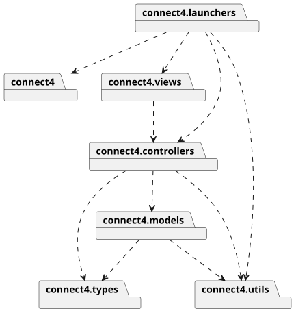

### detailed view

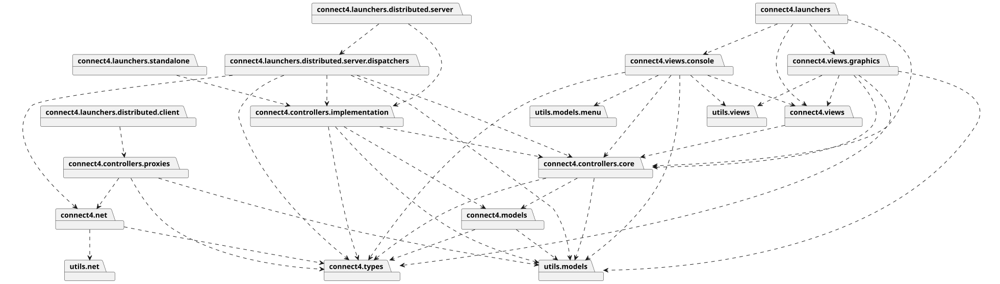

## launchers Package

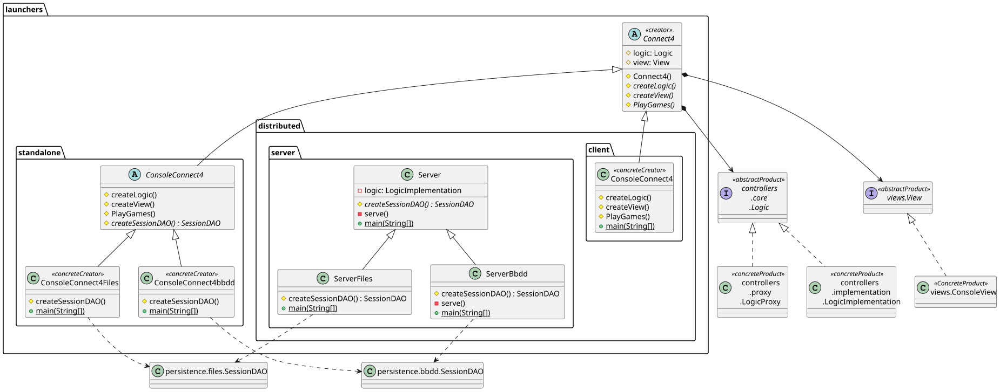

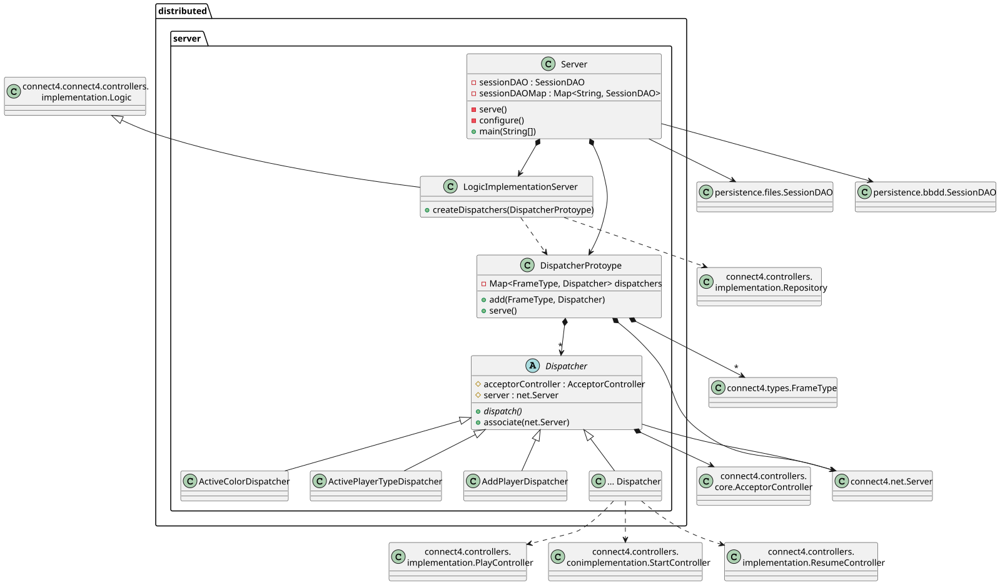

## connect4.controllers Package

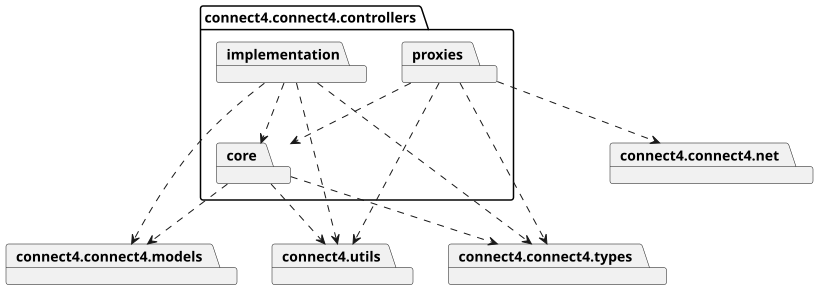

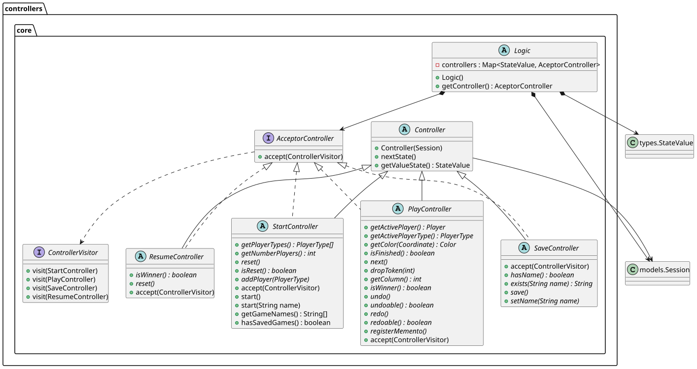

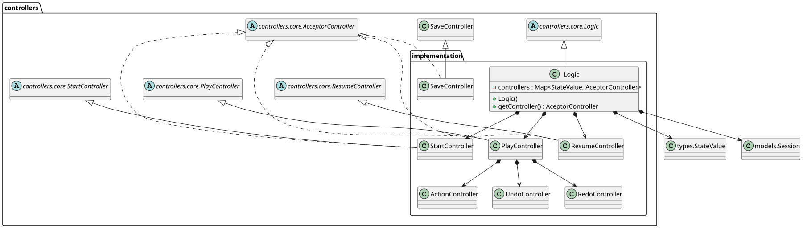

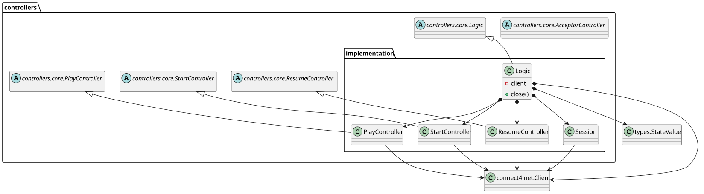

## connect4.views.views Package

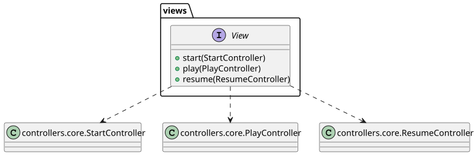

## connect4.views.console Package

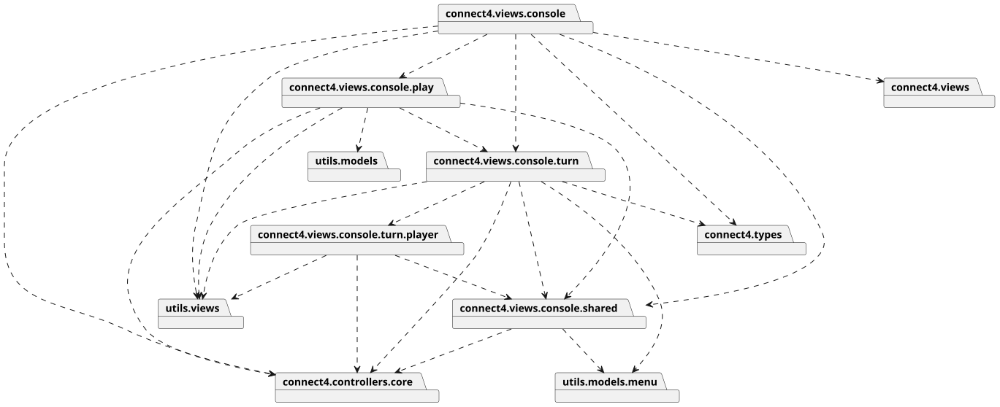

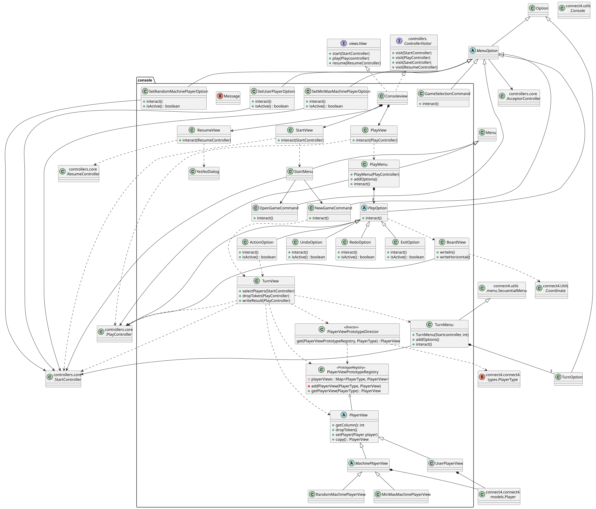

## connect4.views.graphics Package

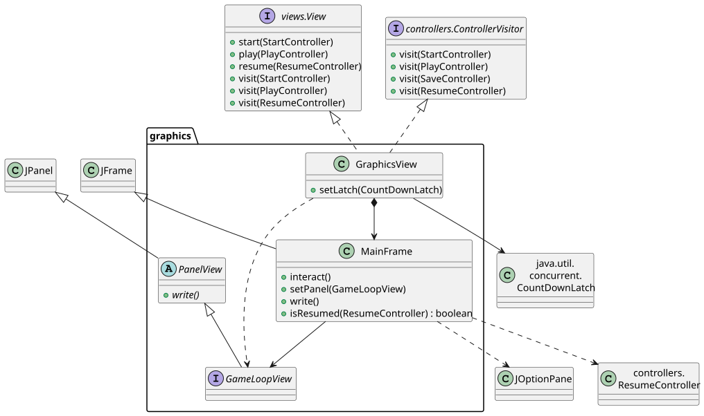

## connect4.models Package

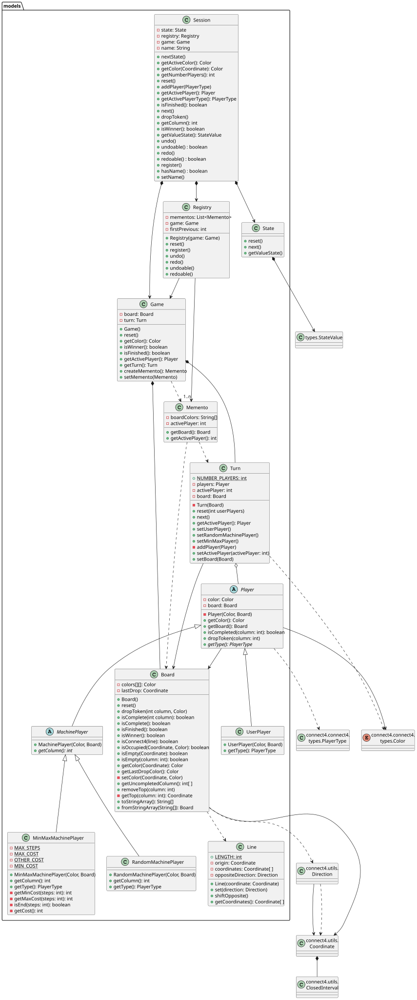

## connect4.net Package

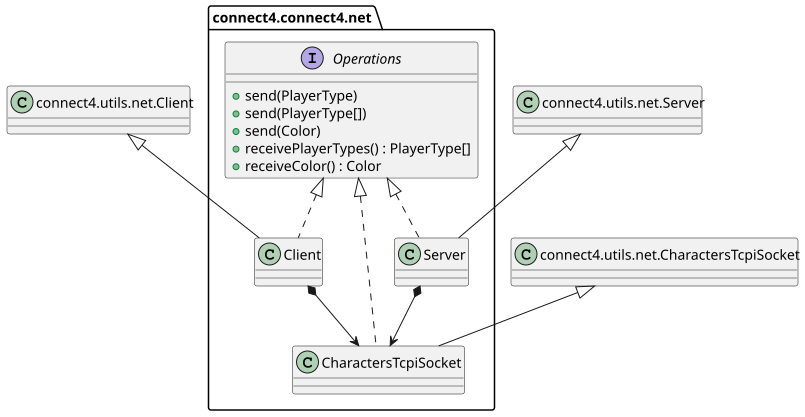

## connect4.types Package

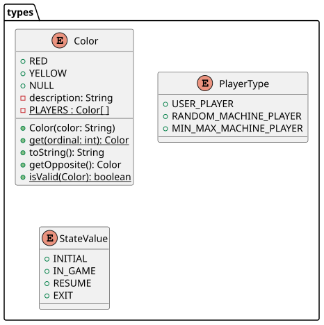

## connect4.utils Package

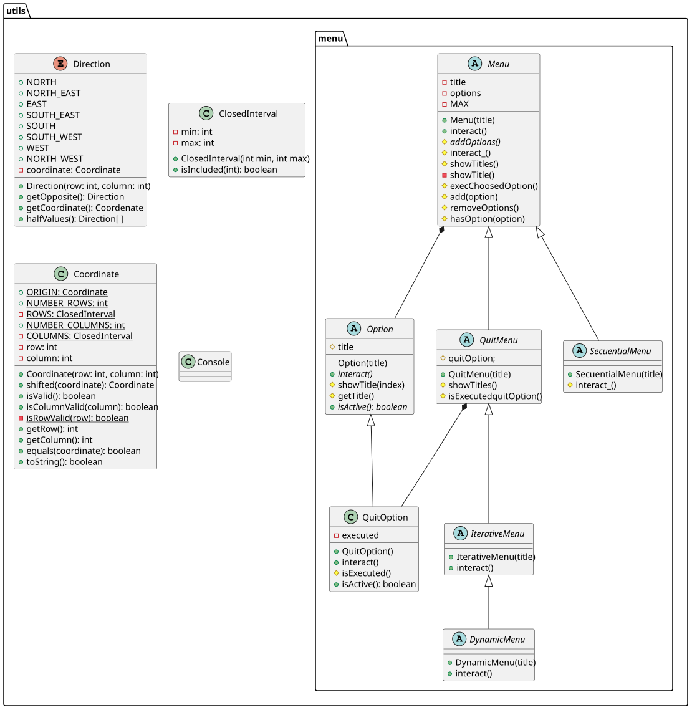

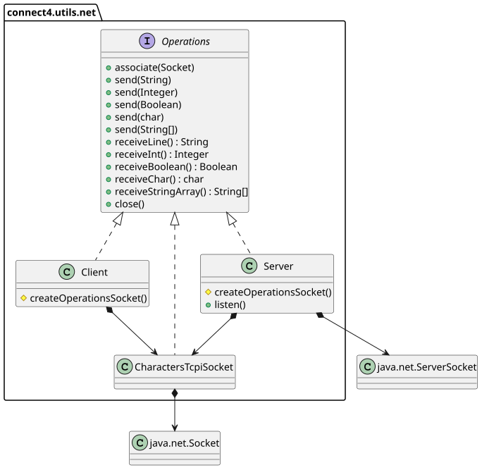

# Vista de Desarrollo/Implementación

# Vista de Despliegue/Física

# Vista de Procesos

- No hay concurrencia

# Calidad del Software

