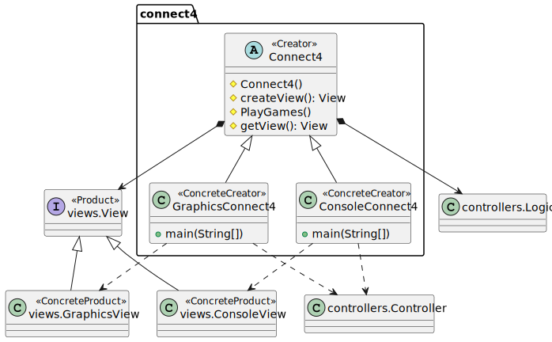
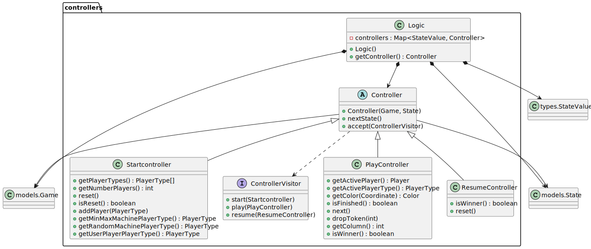
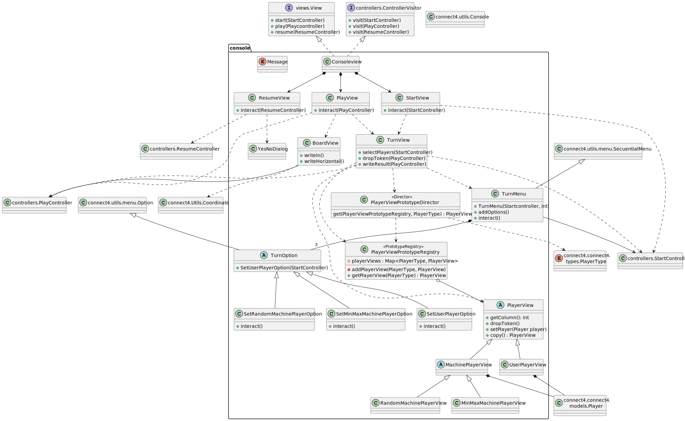
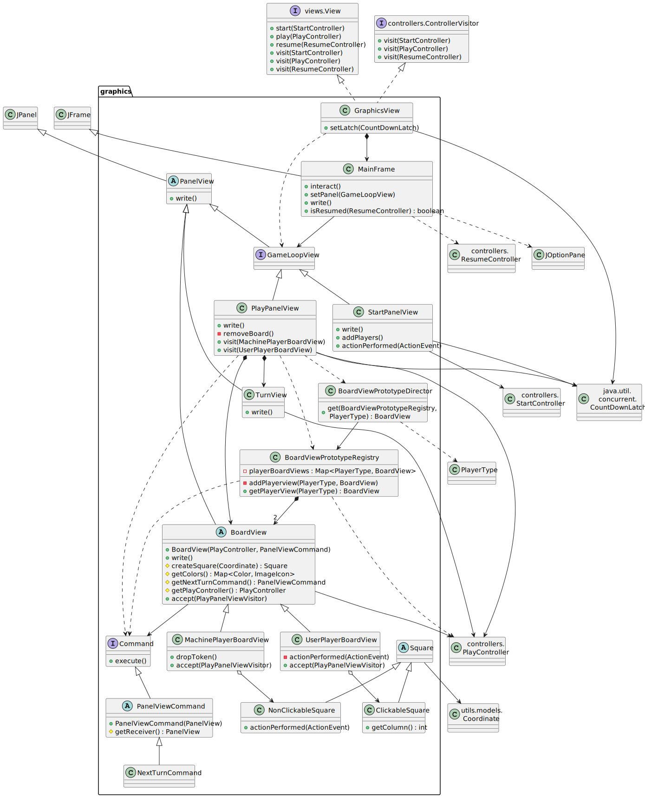
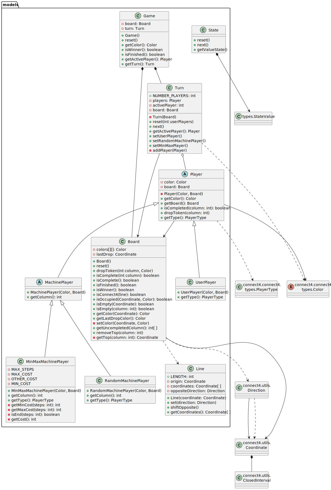

# Connect 4. Solution v.1.7 modelViewPresenter - presentationModel - withFacade

# Requisitos 1. *Machine*

* Funcionalidad: **Jugador persona, máquina aleatorio y máquina con inteligencia artificial**
* Interfaz: **Gráfica y Texto**
* Distribución: **Standalone**
* Persistencia: **No**

# Vista de Lógica/Diseño

  - Modelo/Vista/Presentador con Presentador del Modelo con Vista Achicada

## Arquitectura

## connect4 Package

## connect4.controllers Package

## connect4.views.views Package

## connect4.views.console Package

## connect4.views.graphics Package

## connect4.models Package

## connect4.types Package

## connect4.utils Package

# Vista de Desarrollo/Implementación

# Vista de Despliegue/Física

# Vista de Procesos

- No hay concurrencia

# Calidad del Software

